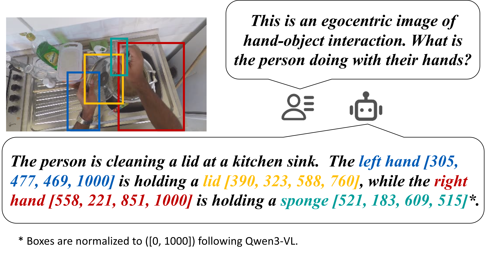
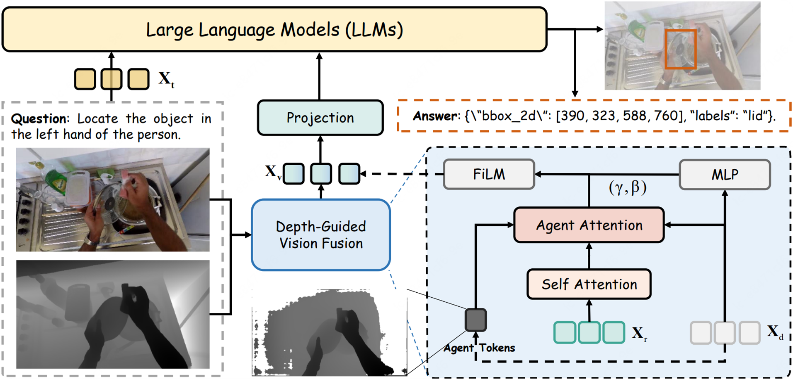

# DEHOI: A Depth-Enhanced Vision-Language Model for Egocentric Hand-Object Interaction Understanding

  
 

 
 

   
   
   
 

 

This is the official repository for **"DEHOI: A Depth-Enhanced Vision-Language Model for Egocentric Hand-Object Interaction Understanding"**, accepted as a **Spotlight** at **IEEE ICME 2026**.

## 📋 Abstract

Egocentric hand-object interaction (HOI) understanding is a fundamental problem for embodied intelligence, as it directly reflects how humans perceive and manipulate objects in the physical world. Recent Vision Language Models (VLMs) have achieved remarkable progress in multimodal reasoning and open-vocabulary understanding. However, their performance remains limited in egocentric settings due to the unique challenges of first-person data, including severe motion blur, frequent occlusions by hands, small manipulated objects, and cluttered backgrounds. As a result, RGB-only models often rely on language priors rather than reliable visual evidence for interaction reasoning. In this work, we propose DEHOI, a depth-enhanced Vision Language Model for egocentric HOI understanding. By incorporating depth information as an explicit geometric cue, DEHOI provides complementary spatial information that helps disambiguate foreground interactions from background clutter. We design an effective depth integration strategy that selectively leverages depth to guide visual reasoning while maintaining compatibility with pretrained VLMs. Extensive experiments on egocentric HOI benchmarks show that DEHOI consistently improves object recognition, localization, and interaction reasoning over strong RGB-based baselines, especially for interaction-centric tasks.

## 🏗️ Architecture

  

DEHOI augments a pretrained VLM (Qwen3VL) with a two-stage depth fusion strategy:

- **Stage 1 — Agent Attention**: Distills compact agent tokens from depth features to selectively inject local geometric cues into RGB representations.
- **Stage 2 — FiLM Modulation**: Maps depth features to scale and bias parameters for global depth-conditioned modulation of RGB tokens.

## 📊 Main Results

Results on HOI-QA benchmark:

| Model | N-A | BB-A | Avg.IoU |
|-------|-----|------|---------|
| MiniGPT-v2-7B | 6.70 | 22.46 | 24.49 |
| VLM4HOI-7B | 17.78 | 50.26 | 43.21 |
| Qwen3VL-8B | 38.52 | 44.51 | 50.72 |
| Qwen3VL-8B* | 44.76 | 60.01 | 52.73 |
| **DEHOI (Ours)** | **45.83** | **62.70** | **56.40** |

## 🔧 Code

**Code will be released soon.** Stay tuned!

## 📖 Citation

## 🙏 Acknowledgements

This work is built upon [Qwen3-VL](https://github.com/QwenLM/Qwen2.5-VL), [Depth Anything V3](https://github.com/DepthAnything/Depth-Anything-V3), and [HOI-Ref](https://github.com/Sid2697/HOI-Ref). We thank the authors for their excellent work.

## 📬 Contact

For questions, please open an issue or contact [hhf_mc@nuaa.edu.cn](mailto:hhf_mc@nuaa.edu.cn).
